Clustering
================
Alex Di Genova
2024-07-10

## K-means

``` r
# Load necessary library
library(ggplot2)

# Create a sample dataset
set.seed(123) # For reproducibility
data <- data.frame(
  x = c(rnorm(50, mean = 1, sd = 0.5), rnorm(50, mean = 5, sd = 0.5)),
  y = c(rnorm(50, mean = 1, sd = 0.5), rnorm(50, mean = 5, sd = 0.5)),
   z = c(rnorm(50, mean = 1, sd = 0.5), rnorm(50, mean = 5, sd = 0.5))
)

# Visualize the data
ggplot(data, aes(x = x, y = y)) + 
  geom_point() + 
  ggtitle("Original Data")
```

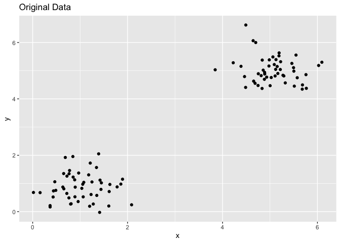<!-- -->

``` r
# Apply K-means clustering
set.seed(123) # For reproducibility
kmeans_result <- kmeans(data, centers = 2, nstart = 25)

# Add the cluster assignment to the dataset
data$cluster <- as.factor(kmeans_result$cluster)

# Visualize the clustered data
ggplot(data, aes(x = x, y = y,z=z, color = cluster)) + 
  geom_point() + 
  ggtitle("K-means Clustering Result")
```

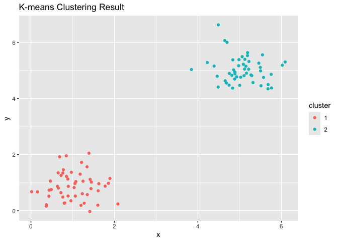<!-- -->

``` r
# Print cluster centers
print(kmeans_result$centers)
```

    ##          x         y         z
    ## 1 1.017202 0.8730498 0.9957397
    ## 2 5.073204 5.0194034 5.1247254

### in combination with PCA

    ## 
    ## Attaching package: 'dplyr'

    ## The following objects are masked from 'package:stats':
    ## 
    ##     filter, lag

    ## The following objects are masked from 'package:base':
    ## 
    ##     intersect, setdiff, setequal, union

    ## Welcome! Want to learn more? See two factoextra-related books at https://goo.gl/ve3WBa

    ## Importance of components:
    ##                           PC1    PC2     PC3     PC4
    ## Standard deviation     1.5749 0.9949 0.59713 0.41645
    ## Proportion of Variance 0.6201 0.2474 0.08914 0.04336
    ## Cumulative Proportion  0.6201 0.8675 0.95664 1.00000

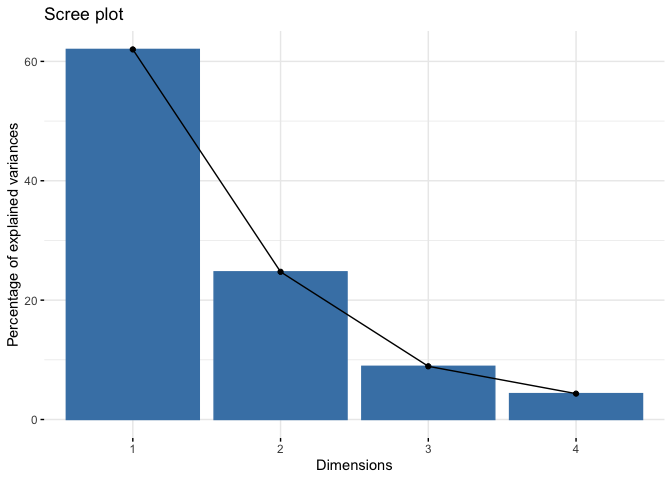<!-- -->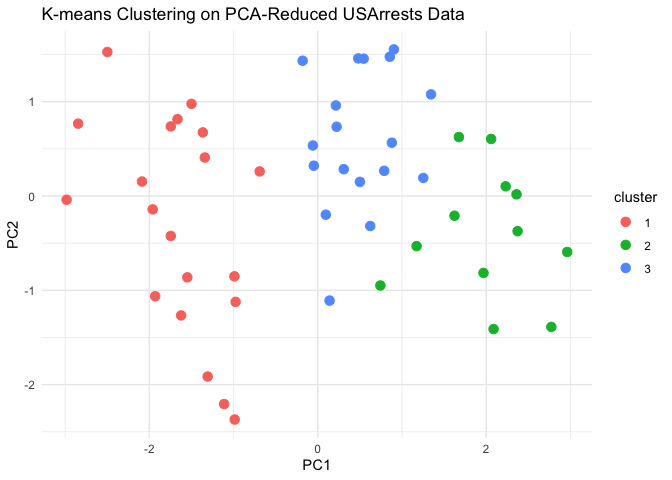<!-- -->

    ##         PC1        PC2
    ## 1 -1.645026 -0.2966625
    ## 2  2.002412 -0.4097244
    ## 3  0.492865  0.6027746

### Evaluation and visualization

``` r
# Load necessary libraries
library(ggplot2)
library(dplyr)
library(factoextra)
library(cluster)
library(clusterSim)
```

    ## Warning: package 'clusterSim' was built under R version 4.3.3

    ## Loading required package: MASS

    ## 
    ## Attaching package: 'MASS'

    ## The following object is masked from 'package:dplyr':
    ## 
    ##     select

``` r
library(clValid)

# Load and standardize the USArrests dataset
data("USArrests")

# Perform PCA and extract the first two principal components
pca_result <- prcomp(data_scaled, center = TRUE, scale. = TRUE)
pca_data <- data.frame(pca_result$x[, 1:2])

# Apply K-means clustering on the principal components
set.seed(123)
kmeans_result <- kmeans(pca_data, centers = 4, nstart = 25)
clusters <- kmeans_result$cluster

# Davies-Bouldin Index
dbi <- index.DB(pca_data, clusters, centrotypes = "centroids")$DB
cat("Davies-Bouldin Index:", dbi, "\n")
```

    ## Davies-Bouldin Index: 0.8122442

``` r
# Dunn Index
dunn_index <- dunn(dist(pca_data),clusters)
cat("Dunn Index:", dunn_index, "\n")
```

    ## Dunn Index: 0.2049642

``` r
# Pseudo F Statistic
pseudo_f <- (sum(kmeans_result$betweenss) / (kmeans_result$totss / (nrow(pca_data) - kmeans_result$tot.withinss)))
cat("Pseudo F Statistic:", pseudo_f, "\n")
```

    ## Pseudo F Statistic: 14.33808

``` r
#Showing for k-means cluster with clusters = 3
#The silhouette coefficient contrasts the average distance to elements in the same cluster with the average distance to elements in other clusters. Objects with a high silhouette value are considered well clustered; objects with a low value may be outliers.
sk <-silhouette(clusters,dist(pca_data))
plot(sk)
```

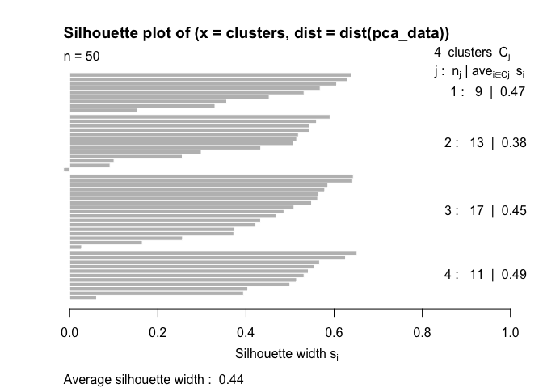<!-- -->

``` r
#GGplot plots
fviz_cluster(kmeans_result,USArrests, ellipse.type = "norm")+
theme_minimal()
```

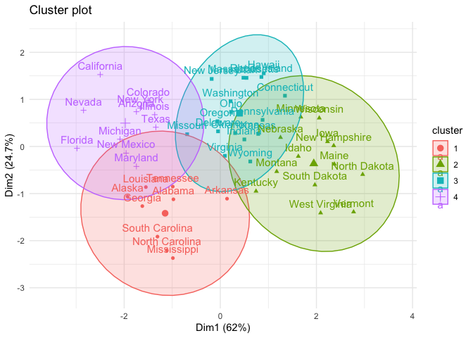<!-- -->

``` r
fviz_silhouette(sk) + theme_minimal()
```

    ##   cluster size ave.sil.width
    ## 1       1    9          0.47
    ## 2       2   13          0.38
    ## 3       3   17          0.45
    ## 4       4   11          0.49

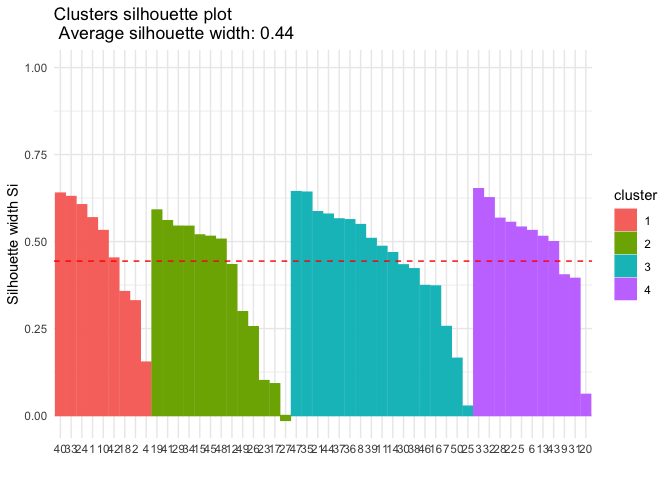<!-- -->

# HC

``` r
# Load necessary libraries
library(ggplot2)
library(dendextend)
```

    ## 
    ## ---------------------
    ## Welcome to dendextend version 1.17.1
    ## Type citation('dendextend') for how to cite the package.
    ## 
    ## Type browseVignettes(package = 'dendextend') for the package vignette.
    ## The github page is: https://github.com/talgalili/dendextend/
    ## 
    ## Suggestions and bug-reports can be submitted at: https://github.com/talgalili/dendextend/issues
    ## You may ask questions at stackoverflow, use the r and dendextend tags: 
    ##   https://stackoverflow.com/questions/tagged/dendextend
    ## 
    ##  To suppress this message use:  suppressPackageStartupMessages(library(dendextend))
    ## ---------------------

    ## 
    ## Attaching package: 'dendextend'

    ## The following object is masked from 'package:stats':
    ## 
    ##     cutree

``` r
# Load the USArrests dataset
data("USArrests")

# Standardize the data
data_scaled <- scale(USArrests)

# Compute the distance matrix
dist_matrix <- dist(data_scaled, method = "manhattan")

# Perform hierarchical clustering using complete linkage
hc_complete <- hclust(dist_matrix, method = "complete")

# Plot the dendrogram
plot(hc_complete, main = "Dendrogram for USArrests (Complete Linkage)", xlab = "", sub = "", cex = 0.9)
```

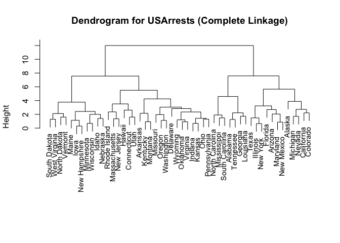<!-- -->

``` r
# Cut the dendrogram to form clusters
cutree_res <- cutree(hc_complete, k = 4) # Cut the dendrogram into 4 clusters

# Visualize the clusters on a scatter plot of the first two principal components
pca_result <- prcomp(data_scaled)
pca_data <- data.frame(pca_result$x[, 1:2])
pca_data$cluster <- as.factor(cutree_res)

ggplot(pca_data, aes(x = PC1, y = PC2, color = cluster)) + 
  geom_point(size = 3) + 
  ggtitle("Hierarchical Clustering on PCA-Reduced USArrests Data (Complete Linkage)") +
  theme_minimal()
```

<!-- -->

### Evaluation example

``` r
# Load necessary libraries
library(cluster)
library(factoextra)
library(dendextend)
library(clusterSim)

# Load the USArrests dataset
data("USArrests")

# Standardize the data
data_scaled <- scale(USArrests)

# Compute the distance matrix
dist_matrix <- dist(data_scaled, method = "minkowski")

# Perform hierarchical clustering using complete linkage
hc_complete <- hclust(dist_matrix, method = "complete")

# Cut the dendrogram to form clusters
cutree_res <- cutree(hc_complete, k = 4) # Cut the dendrogram into 4 clusters

# Add the cluster assignment to the original data
USArrests$cluster <- as.factor(cutree_res)

# Visualize the dendrogram
dend <- as.dendrogram(hc_complete)
dend <- color_branches(dend, k = 4)
plot(dend, main = "Dendrogram for USArrests (Complete Linkage)", xlab = "", sub = "", cex = 0.9)
```

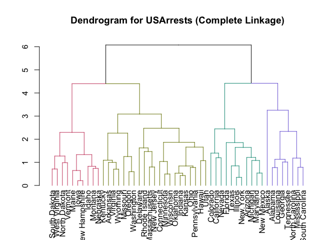<!-- -->

``` r
# Perform PCA for visualization
pca_result <- prcomp(data_scaled)
pca_data <- data.frame(pca_result$x[, 1:2])
pca_data$cluster <- as.factor(cutree_res)

# Visualize the clusters on a scatter plot of the first two principal components
ggplot(pca_data, aes(x = PC1, y = PC2, color = cluster)) + 
  geom_point(size = 3) + 
  ggtitle("Hierarchical Clustering on PCA-Reduced USArrests Data (Complete Linkage)") +
  theme_minimal()
```

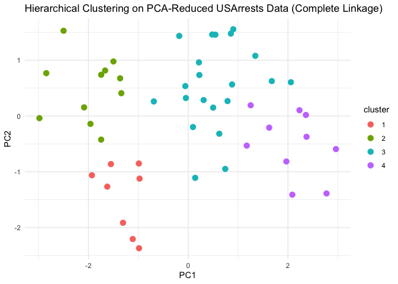<!-- -->

``` r
# Evaluate clustering with silhouette score
sil <- silhouette(cutree_res, dist_matrix)
fviz_silhouette(sil)
```

    ##   cluster size ave.sil.width
    ## 1       1    8          0.32
    ## 2       2   11          0.38
    ## 3       3   21          0.22
    ## 4       4   10          0.44

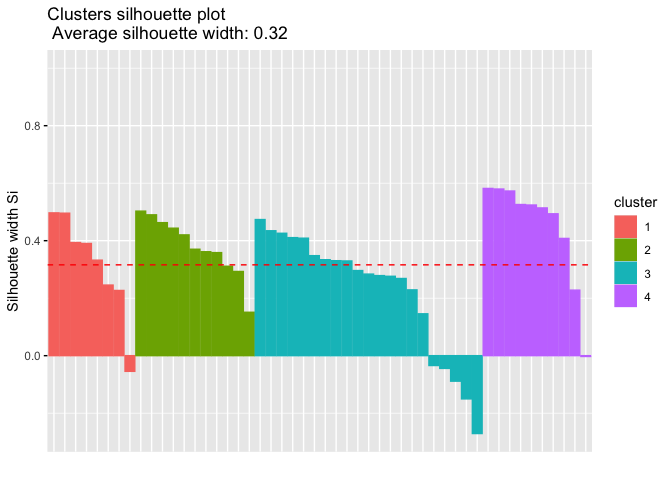<!-- -->

``` r
# Print average silhouette width
cat("Average silhouette width:", mean(sil[, 3]), "\n")
```

    ## Average silhouette width: 0.3159551

``` r
# Compute Dunn Index
dunn_index <- dunn(clusters = cutree_res, Data = dist_matrix)
cat("Dunn Index:", dunn_index, "\n")
```

    ## Dunn Index: 0.1786575

``` r
# Compute Davies-Bouldin Index
dbi <- index.DB(data_scaled, cutree_res, centrotypes = "centroids")$DB
cat("Davies-Bouldin Index:", dbi, "\n")
```

    ## Davies-Bouldin Index: 1.081106
