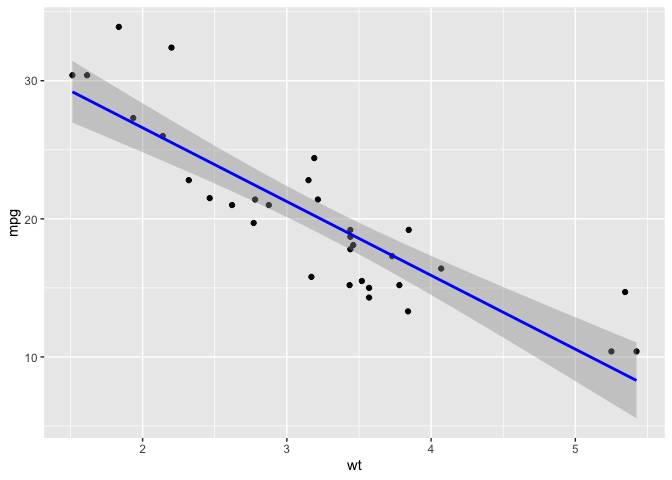
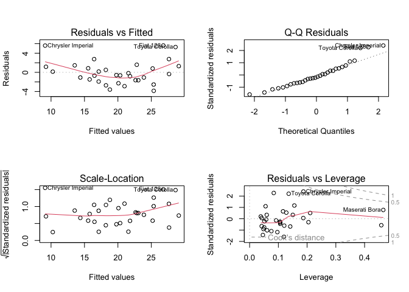
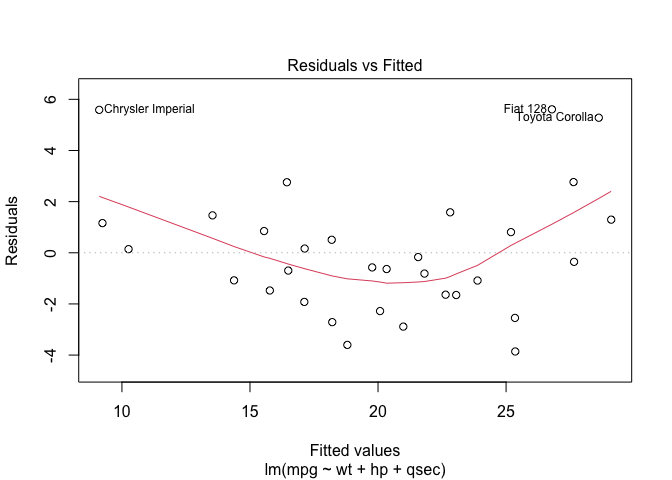
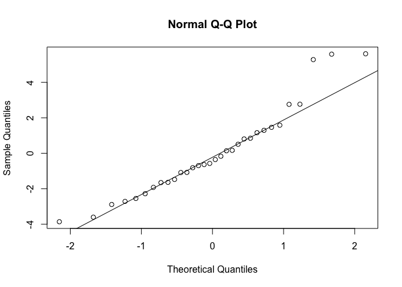
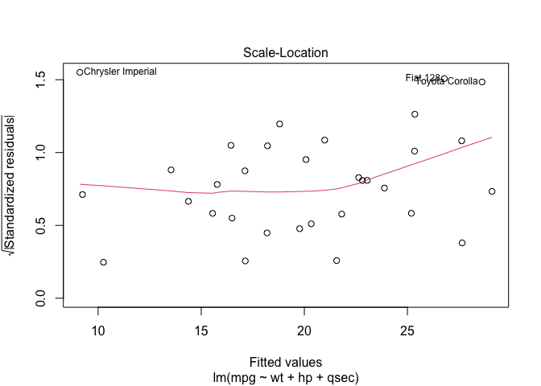

Linear Models
================
Alex Di Genova
2024-06-25

## Linear models

### simple

``` r
# Load necessary libraries
library(ggplot2)

# Load the data
data(mtcars)
head(mtcars)
```

    ##                    mpg cyl disp  hp drat    wt  qsec vs am gear carb
    ## Mazda RX4         21.0   6  160 110 3.90 2.620 16.46  0  1    4    4
    ## Mazda RX4 Wag     21.0   6  160 110 3.90 2.875 17.02  0  1    4    4
    ## Datsun 710        22.8   4  108  93 3.85 2.320 18.61  1  1    4    1
    ## Hornet 4 Drive    21.4   6  258 110 3.08 3.215 19.44  1  0    3    1
    ## Hornet Sportabout 18.7   8  360 175 3.15 3.440 17.02  0  0    3    2
    ## Valiant           18.1   6  225 105 2.76 3.460 20.22  1  0    3    1

``` r
# Fit a simple linear regression model
model <- lm(mpg ~ wt, data=mtcars)

# Summary of the model
summary(model)
```

    ## 
    ## Call:
    ## lm(formula = mpg ~ wt, data = mtcars)
    ## 
    ## Residuals:
    ##     Min      1Q  Median      3Q     Max 
    ## -4.5432 -2.3647 -0.1252  1.4096  6.8727 
    ## 
    ## Coefficients:
    ##             Estimate Std. Error t value Pr(>|t|)    
    ## (Intercept)  37.2851     1.8776  19.858  < 2e-16 ***
    ## wt           -5.3445     0.5591  -9.559 1.29e-10 ***
    ## ---
    ## Signif. codes:  0 '***' 0.001 '**' 0.01 '*' 0.05 '.' 0.1 ' ' 1
    ## 
    ## Residual standard error: 3.046 on 30 degrees of freedom
    ## Multiple R-squared:  0.7528, Adjusted R-squared:  0.7446 
    ## F-statistic: 91.38 on 1 and 30 DF,  p-value: 1.294e-10

``` r
# Plotting the data and the model
ggplot(mtcars, aes(x=wt, y=mpg)) +
  geom_point() +
  geom_smooth(method="lm", col="blue")
```

    ## `geom_smooth()` using formula = 'y ~ x'

<!-- --> \### multiple

``` r
# Fit a multiple linear regression model
model_mult <- lm(mpg ~ wt + hp + qsec, data=mtcars)

# Summary of the model
summary(model_mult)
```

    ## 
    ## Call:
    ## lm(formula = mpg ~ wt + hp + qsec, data = mtcars)
    ## 
    ## Residuals:
    ##     Min      1Q  Median      3Q     Max 
    ## -3.8591 -1.6418 -0.4636  1.1940  5.6092 
    ## 
    ## Coefficients:
    ##             Estimate Std. Error t value Pr(>|t|)    
    ## (Intercept) 27.61053    8.41993   3.279  0.00278 ** 
    ## wt          -4.35880    0.75270  -5.791 3.22e-06 ***
    ## hp          -0.01782    0.01498  -1.190  0.24418    
    ## qsec         0.51083    0.43922   1.163  0.25463    
    ## ---
    ## Signif. codes:  0 '***' 0.001 '**' 0.01 '*' 0.05 '.' 0.1 ' ' 1
    ## 
    ## Residual standard error: 2.578 on 28 degrees of freedom
    ## Multiple R-squared:  0.8348, Adjusted R-squared:  0.8171 
    ## F-statistic: 47.15 on 3 and 28 DF,  p-value: 4.506e-11

``` r
# Diagnostic plots
par(mfrow=c(2,2))
plot(model_mult)
```

<!-- -->

``` r
# Coefficients
coef(model_mult)
```

    ## (Intercept)          wt          hp        qsec 
    ## 27.61052686 -4.35879720 -0.01782227  0.51083369

``` r
# R-squared
summary(model_mult)$r.squared
```

    ## [1] 0.8347678

``` r
# P-values
summary(model_mult)$coefficients[,4]
```

    ##  (Intercept)           wt           hp         qsec 
    ## 2.784556e-03 3.217222e-06 2.441762e-01 2.546284e-01

## Model Diagnosis

``` r
plot(model_mult, which=1)  # Residuals vs Fitted plot
```

<!-- -->

``` r
# Look for a random scatter of residuals around the horizontal line at zero.
```

``` r
qqnorm(resid(model_mult))
qqline(resid(model_mult))
```

<!-- -->

``` r
plot(model_mult, which=3)  # Scale-Location plot
```

<!-- -->

``` r
library(car)
```

    ## Loading required package: carData

``` r
durbinWatsonTest(model_mult)
```

    ##  lag Autocorrelation D-W Statistic p-value
    ##    1       0.2742427      1.422421    0.06
    ##  Alternative hypothesis: rho != 0

# Examples

1.  Predicting Housing Prices Objective: To predict the price of houses
    based on various features like the number of bedrooms, square
    footage, age of the house, and location.

``` r
# Load necessary library
library(MASS)

# Load the Boston housing dataset
data("Boston")

# Fit a multiple linear regression model
#dis=weighted mean of distances to five Boston employment centres
#lstat=lower status of the population 
#medv = median value of owner-occupied homes in
#rm = average number of rooms per dwelling.
# age = proportion of owner-occupied units built prior to 1940.
housing_model <- lm(medv ~ lstat + rm + age + dis, data=Boston)

# Summary of the model
summary(housing_model)
```

    ## 
    ## Call:
    ## lm(formula = medv ~ lstat + rm + age + dis, data = Boston)
    ## 
    ## Residuals:
    ##      Min       1Q   Median       3Q      Max 
    ## -19.0084  -3.0948  -0.9635   1.7074  26.7732 
    ## 
    ## Coefficients:
    ##             Estimate Std. Error t value Pr(>|t|)    
    ## (Intercept)  4.07985    3.43673   1.187 0.235738    
    ## lstat       -0.68478    0.05383 -12.721  < 2e-16 ***
    ## rm           4.99039    0.44852  11.126  < 2e-16 ***
    ## age         -0.02545    0.01437  -1.771 0.077236 .  
    ## dis         -0.65876    0.17486  -3.767 0.000185 ***
    ## ---
    ## Signif. codes:  0 '***' 0.001 '**' 0.01 '*' 0.05 '.' 0.1 ' ' 1
    ## 
    ## Residual standard error: 5.471 on 501 degrees of freedom
    ## Multiple R-squared:  0.649,  Adjusted R-squared:  0.6462 
    ## F-statistic: 231.6 on 4 and 501 DF,  p-value: < 2.2e-16

2.  Predicting Employee Salary

Objective: To predict employee salary based on years of experience,
education level, and job role. Dataset: A hypothetical dataset
containing employee information.

``` r
# Hypothetical dataset
employee_data <- data.frame(
  salary = c(60000, 70000, 80000, 120000, 100000, 95000, 75000),
  experience = c(5, 6, 7, 10, 8, 9, 6),
  education = c(1, 2, 2, 3, 2, 3, 2),  # 1: Bachelor's, 2: Master's, 3: PhD
  role = as.factor(c("Analyst", "Analyst", "Manager", "Manager", "Analyst", "Manager", "Analyst"))
)

# Fit a multiple linear regression model
salary_model <- lm(salary ~ experience + education + role, data=employee_data)

# Summary of the model
summary(salary_model)
```

    ## 
    ## Call:
    ## lm(formula = salary ~ experience + education + role, data = employee_data)
    ## 
    ## Residuals:
    ##       1       2       3       4       5       6       7 
    ## -2327.6  -948.3  2327.6  3879.3  -775.9 -6206.9  4051.7 
    ## 
    ## Coefficients:
    ##             Estimate Std. Error t value Pr(>|t|)  
    ## (Intercept)    -5948      11070  -0.537   0.6283  
    ## experience     14914       2836   5.259   0.0134 *
    ## education      -6293       7312  -0.861   0.4527  
    ## roleManager    -8190       5877  -1.393   0.2578  
    ## ---
    ## Signif. codes:  0 '***' 0.001 '**' 0.01 '*' 0.05 '.' 0.1 ' ' 1
    ## 
    ## Residual standard error: 5239 on 3 degrees of freedom
    ## Multiple R-squared:  0.9673, Adjusted R-squared:  0.9347 
    ## F-statistic: 29.63 on 3 and 3 DF,  p-value: 0.009917

experience: Number of years of experience (positive coefficient implies
more experience leads to higher salary). education: Education level
(positive coefficient implies higher education levels lead to higher
salary). role: Job role (categorical variable, with different
coefficients for different roles indicating their impact on salary).

3.  Predicting Disease Progression Objective: To predict the progression
    of a disease based on various biomarkers and patient
    characteristics.

Dataset: A hypothetical dataset containing patient information and
biomarker levels.

``` r
# Hypothetical dataset
disease_data <- data.frame(
  progression = c(3.2, 4.5, 2.8, 6.7, 5.1, 4.3, 3.9),
  biomarker1 = c(2.1, 3.4, 2.0, 5.0, 4.2, 3.8, 3.1),
  biomarker2 = c(1.5, 2.2, 1.7, 3.5, 2.8, 2.4, 2.0),
  age = c(45, 50, 39, 60, 55, 52, 47),
  gender = as.factor(c("M", "F", "M", "F", "M", "F", "M"))
)

# Fit a multiple linear regression model
disease_model <- lm(progression ~ biomarker1 + biomarker2 + age + gender, data=disease_data)

# Summary of the model
summary(disease_model)
```

    ## 
    ## Call:
    ## lm(formula = progression ~ biomarker1 + biomarker2 + age + gender, 
    ##     data = disease_data)
    ## 
    ## Residuals:
    ##        1        2        3        4        5        6        7 
    ## -0.02109  0.20732 -0.07640  0.10624 -0.13608 -0.31356  0.23357 
    ## 
    ## Coefficients:
    ##             Estimate Std. Error t value Pr(>|t|)
    ## (Intercept) -3.14016    2.65726  -1.182    0.359
    ## biomarker1  -0.57220    0.87968  -0.650    0.582
    ## biomarker2   1.55923    0.89820   1.736    0.225
    ## age          0.11896    0.08718   1.365    0.306
    ## genderM     -0.12918    0.32980  -0.392    0.733
    ## 
    ## Residual standard error: 0.3405 on 2 degrees of freedom
    ## Multiple R-squared:  0.9769, Adjusted R-squared:  0.9307 
    ## F-statistic: 21.14 on 4 and 2 DF,  p-value: 0.04568

## Todo

- Try to build a better model for the mtcars and housing dataset.
- Investigate how to select features to build the linear models.
- Explore predicting other vairables for both models.
