PCA
================
Alex Di Genova
2024-07-04

## PCA

### R libraries for PCA

1.  FactoMiner
2.  PCAtools
3.  prcomp
4.  

### FactoMineR

Functions for computing principal component methods and clustering:

Functions Description:

1.  PCA Principal component analysis.
2.  CA Correspondence analysis.
3.  MCA Multiple correspondence analysis.
4.  FAMD Factor analysis of mixed data.
5.  MFA Multiple factor analysis.
6.  HCPC Hierarchical clustering on principal components.
7.  dimdesc Dimension description.

### Factoextra

Visualizing dimension reduction analysis outputs

Functions Description:

1.  fviz_eig (or fviz_eigenvalue) Extract and visualize the
    eigenvalues/variances of dimensions.

2.  fviz_pca Graph of individuals/variables from the output of Principal
    Component Analysis (PCA).

3.  fviz_ca Graph of column/row variables from the output of
    Correspondence Analysis (CA).

4.  fviz_mca Graph of individuals/variables from the output of Multiple
    Correspondence Analysis (MCA).

5.  fviz_mfa Graph of individuals/variables from the output of Multiple
    Factor Analysis (MFA).

6.  fviz_famd Graph of individuals/variables from the output of Factor
    Analysis of Mixed Data (FAMD).

7.  fviz_hmfa Graph of individuals/variables from the output of
    Hierarchical Multiple Factor Analysis (HMFA).

8.  fviz_ellipses Draw confidence ellipses around the categories.

9.  fviz_cos2 Visualize the quality of representation of the row/column
    variable from the results of PCA, CA, MCA functions.

10. fviz_contrib Visualize the contributions of row/column elements from
    the results of PCA, CA, MCA functions.

``` r
# install.packages("factoextra")
# install.packages("FactoMineR") 
library("FactoMineR") # compute principal component methods
library("factoextra") # for extracting, visualizing and interpreting the results.
```

    ## Loading required package: ggplot2

    ## Welcome! Want to learn more? See two factoextra-related books at https://goo.gl/ve3WBa

## Data set 1

The data used here describes athletes’ performance during two sporting
events (Desctar and OlympicG). It contains 27 individuals (athletes)
described by 13 variables.

1.  Active individuals ( rows 1:23) : Individuals that are used during
    the principal component analysis.

2.  Supplementary individuals ( rows 24:27) : The coordinates of these
    individuals will be predicted using the PCA information and
    parameters obtained with active individuals/variables

3.  Active variables ( columns 1:10) : Variables that are used for the
    principal component analysis.

4.  Supplementary variables: As supplementary individuals, the
    coordinates of these variables will be predicted also. These can be:

5.  Supplementary continuous variables: Columns 11 and 12 corresponding
    respectively to the rank and the points of athletes.

6.  Supplementary qualitative variables: Column 13 corresponding to the
    two athletetic meetings (2004 Olympic Game or 2004 Decastar). This
    is a categorical (or factor) variable factor. It can be used to
    color individuals by groups.

``` r
data(decathlon2) # 27 x 13
head(decathlon2)
```

    ##           X100m Long.jump Shot.put High.jump X400m X110m.hurdle Discus
    ## SEBRLE    11.04      7.58    14.83      2.07 49.81        14.69  43.75
    ## CLAY      10.76      7.40    14.26      1.86 49.37        14.05  50.72
    ## BERNARD   11.02      7.23    14.25      1.92 48.93        14.99  40.87
    ## YURKOV    11.34      7.09    15.19      2.10 50.42        15.31  46.26
    ## ZSIVOCZKY 11.13      7.30    13.48      2.01 48.62        14.17  45.67
    ## McMULLEN  10.83      7.31    13.76      2.13 49.91        14.38  44.41
    ##           Pole.vault Javeline X1500m Rank Points Competition
    ## SEBRLE          5.02    63.19  291.7    1   8217    Decastar
    ## CLAY            4.92    60.15  301.5    2   8122    Decastar
    ## BERNARD         5.32    62.77  280.1    4   8067    Decastar
    ## YURKOV          4.72    63.44  276.4    5   8036    Decastar
    ## ZSIVOCZKY       4.42    55.37  268.0    7   8004    Decastar
    ## McMULLEN        4.42    56.37  285.1    8   7995    Decastar

``` r
decathlon2.active <- decathlon2[1:23, 1:10]
head(decathlon2.active)
```

    ##           X100m Long.jump Shot.put High.jump X400m X110m.hurdle Discus
    ## SEBRLE    11.04      7.58    14.83      2.07 49.81        14.69  43.75
    ## CLAY      10.76      7.40    14.26      1.86 49.37        14.05  50.72
    ## BERNARD   11.02      7.23    14.25      1.92 48.93        14.99  40.87
    ## YURKOV    11.34      7.09    15.19      2.10 50.42        15.31  46.26
    ## ZSIVOCZKY 11.13      7.30    13.48      2.01 48.62        14.17  45.67
    ## McMULLEN  10.83      7.31    13.76      2.13 49.91        14.38  44.41
    ##           Pole.vault Javeline X1500m
    ## SEBRLE          5.02    63.19  291.7
    ## CLAY            4.92    60.15  301.5
    ## BERNARD         5.32    62.77  280.1
    ## YURKOV          4.72    63.44  276.4
    ## ZSIVOCZKY       4.42    55.37  268.0
    ## McMULLEN        4.42    56.37  285.1

## Computing PCA

PCA(X,

scale.unit = TRUE, \# a boolean, if TRUE (value set by default) then
data are scaled to unit variance

ncp = 5, \# number of dimensions kept in the results (by default 5)

ind.sup = NULL, \# a vector indicating the indexes of the supplementary
individuals

quanti.sup = NULL, \# a vector indicating the indexes of the
quantitative supplementary variables

quali.sup = NULL, \# a vector indicating the indexes of the categorical
supplementary variables

graph = TRUE, \# boolean, if TRUE a graph is displayed

axes = c(1,2) \# a length 2 vector specifying the components to plot )

``` r
library("FactoMineR")
res.pca <- PCA(decathlon2.active,ncp = 5, graph=FALSE)
print(res.pca)
```

    ## **Results for the Principal Component Analysis (PCA)**
    ## The analysis was performed on 23 individuals, described by 10 variables
    ## *The results are available in the following objects:
    ## 
    ##    name               description                          
    ## 1  "$eig"             "eigenvalues"                        
    ## 2  "$var"             "results for the variables"          
    ## 3  "$var$coord"       "coord. for the variables"           
    ## 4  "$var$cor"         "correlations variables - dimensions"
    ## 5  "$var$cos2"        "cos2 for the variables"             
    ## 6  "$var$contrib"     "contributions of the variables"     
    ## 7  "$ind"             "results for the individuals"        
    ## 8  "$ind$coord"       "coord. for the individuals"         
    ## 9  "$ind$cos2"        "cos2 for the individuals"           
    ## 10 "$ind$contrib"     "contributions of the individuals"   
    ## 11 "$call"            "summary statistics"                 
    ## 12 "$call$centre"     "mean of the variables"              
    ## 13 "$call$ecart.type" "standard error of the variables"    
    ## 14 "$call$row.w"      "weights for the individuals"        
    ## 15 "$call$col.w"      "weights for the variables"

#### getting PCA results

1.  Eigenvalues

``` r
#library("factoextra")
eig.val <- get_eigenvalue(res.pca)
eig.val
```

    ##        eigenvalue variance.percent cumulative.variance.percent
    ## Dim.1   4.1242133        41.242133                    41.24213
    ## Dim.2   1.8385309        18.385309                    59.62744
    ## Dim.3   1.2391403        12.391403                    72.01885
    ## Dim.4   0.8194402         8.194402                    80.21325
    ## Dim.5   0.7015528         7.015528                    87.22878
    ## Dim.6   0.4228828         4.228828                    91.45760
    ## Dim.7   0.3025817         3.025817                    94.48342
    ## Dim.8   0.2744700         2.744700                    97.22812
    ## Dim.9   0.1552169         1.552169                    98.78029
    ## Dim.10  0.1219710         1.219710                   100.00000

An eigenvalue \> 1 indicates that PCs account for more variance than
accounted by one of the original variables in standardized data. This is
commonly used as a cutoff point for which PCs are retained. This holds
true only when the data are standardized.

Limit the number of component to that number that accounts for a certain
fraction of the total variance. For example, if you are satisfied with
70% of the total variance explained then use the number of components to
achieve that.

``` r
fviz_eig(res.pca, addlabels = TRUE, ylim = c(0, 50))
```

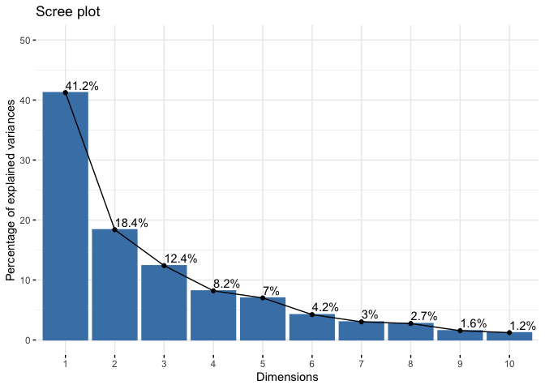<!-- --> \## Variables

The components of the get_pca_var() can be used in the plot of variables
as follow:

1.  var\$coord: coordinates of variables to create a scatter plot
2.  var\$cos2: represents the quality of representation for variables on
    the factor map. It’s calculated as the squared coordinates: var.cos2
    = var.coord \* var.coord.
3.  var\$contrib: contains the contributions (in percentage) of the
    variables to the principal components. The contribution of a
    variable (var) to a given principal component is (in percentage) :
    (var.cos2 \* 100) / (total cos2 of the component).

``` r
var <- get_pca_var(res.pca)
var
```

    ## Principal Component Analysis Results for variables
    ##  ===================================================
    ##   Name       Description                                    
    ## 1 "$coord"   "Coordinates for the variables"                
    ## 2 "$cor"     "Correlations between variables and dimensions"
    ## 3 "$cos2"    "Cos2 for the variables"                       
    ## 4 "$contrib" "contributions of the variables"

``` r
# Coordinates
head(var$coord)
```

    ##                   Dim.1       Dim.2      Dim.3       Dim.4      Dim.5
    ## X100m        -0.8506257 -0.17939806  0.3015564  0.03357320 -0.1944440
    ## Long.jump     0.7941806  0.28085695 -0.1905465 -0.11538956  0.2331567
    ## Shot.put      0.7339127  0.08540412  0.5175978  0.12846837 -0.2488129
    ## High.jump     0.6100840 -0.46521415  0.3300852  0.14455012  0.4027002
    ## X400m        -0.7016034  0.29017826  0.2835329  0.43082552  0.1039085
    ## X110m.hurdle -0.7641252 -0.02474081  0.4488873 -0.01689589  0.2242200

``` r
# Cos2: quality on the factore map
head(var$cos2)
```

    ##                  Dim.1        Dim.2      Dim.3        Dim.4      Dim.5
    ## X100m        0.7235641 0.0321836641 0.09093628 0.0011271597 0.03780845
    ## Long.jump    0.6307229 0.0788806285 0.03630798 0.0133147506 0.05436203
    ## Shot.put     0.5386279 0.0072938636 0.26790749 0.0165041211 0.06190783
    ## High.jump    0.3722025 0.2164242070 0.10895622 0.0208947375 0.16216747
    ## X400m        0.4922473 0.0842034209 0.08039091 0.1856106269 0.01079698
    ## X110m.hurdle 0.5838873 0.0006121077 0.20149984 0.0002854712 0.05027463

``` r
# Contributions to the principal components
head(var$contrib)
```

    ##                  Dim.1      Dim.2     Dim.3       Dim.4     Dim.5
    ## X100m        17.544293  1.7505098  7.338659  0.13755240  5.389252
    ## Long.jump    15.293168  4.2904162  2.930094  1.62485936  7.748815
    ## Shot.put     13.060137  0.3967224 21.620432  2.01407269  8.824401
    ## High.jump     9.024811 11.7715838  8.792888  2.54987951 23.115504
    ## X400m        11.935544  4.5799296  6.487636 22.65090599  1.539012
    ## X110m.hurdle 14.157544  0.0332933 16.261261  0.03483735  7.166193

### Correlation circle

The correlation between a variable and a principal component (PC) is
used as the coordinates of the variable on the PC.

1.  Positively correlated variables are grouped together.
2.  Negatively correlated variables are positioned on opposite sides of
    the plot origin (opposed
3.  The distance between variables and the origin measures the quality
    of the variables on the factor map. Variables that are away from the
    origin are well represented on the factor map.

``` r
fviz_pca_var(res.pca,col.var="blue")
```

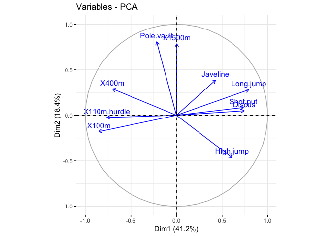<!-- -->

### Quality of representation

The quality of representation of the variables on factor map is called
cos2 (square cosine, squared coordinates)

``` r
head(var$cos2, 4)
```

    ##               Dim.1       Dim.2      Dim.3      Dim.4      Dim.5
    ## X100m     0.7235641 0.032183664 0.09093628 0.00112716 0.03780845
    ## Long.jump 0.6307229 0.078880629 0.03630798 0.01331475 0.05436203
    ## Shot.put  0.5386279 0.007293864 0.26790749 0.01650412 0.06190783
    ## High.jump 0.3722025 0.216424207 0.10895622 0.02089474 0.16216747

correlation

``` r
library("corrplot") 
```

    ## corrplot 0.92 loaded

``` r
corrplot(var$cos2, is.corr=FALSE)
```

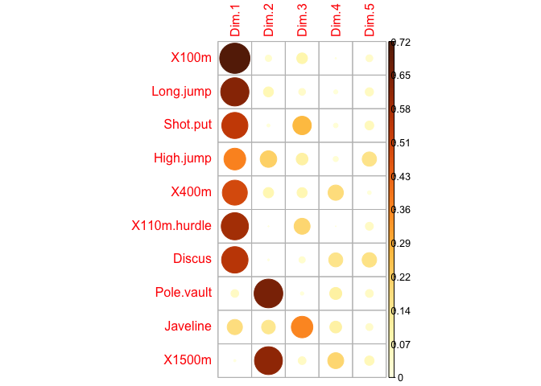<!-- -->

Looking at particular components

``` r
# Total cos2 of variables on Dim.1 
fviz_cos2(res.pca, choice = "var", axes = 1)
```

<!-- -->

1.  A high cos2 indicates a good representation of the variable on the
    principal component. In this case the variable is positioned close
    to the circumference of the correlation circle.

2.  A low cos2 indicates that the variable is not perfectly represented
    by the PCs. In this case the variable is close to the center of the
    circle.

``` r
# Color by cos2 values: quality on the factor map
fviz_pca_var(res.pca, col.var = "cos2",gradient.cols = c("#00AFBB", "#E7B800", "#FC4E07"),repel = TRUE)
```

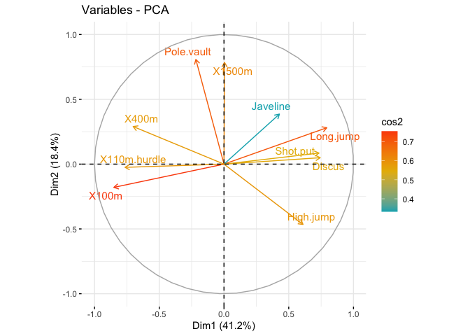<!-- -->

In summary: 1. The cos2 values are used to estimate the quality of the
representation 2. The closer a variable is to the circle of
correlations, the better its representation on the factor map (and the
more important it is to interpret these components) 3. Variables that
are closed to the center of the plot are less important for the first
components.

### Contributions of variables to PCs

The contributions of variables in accounting for the variability in a
given principal component are expressed in percentage.

1.  Variables that are correlated with PC1 (i.e., Dim.1) and PC2 (i.e.,
    Dim.2) are the most important in explaining the variability in the
    data set.
2.  Variables that do not correlated with any PC or correlated with the
    last dimensions are variables with low contribution and might be
    removed to simplify the overall analysis.

``` r
head(var$contrib, 4)
```

    ##               Dim.1      Dim.2     Dim.3     Dim.4     Dim.5
    ## X100m     17.544293  1.7505098  7.338659 0.1375524  5.389252
    ## Long.jump 15.293168  4.2904162  2.930094 1.6248594  7.748815
    ## Shot.put  13.060137  0.3967224 21.620432 2.0140727  8.824401
    ## High.jump  9.024811 11.7715838  8.792888 2.5498795 23.115504

``` r
library("corrplot") 
corrplot(var$contrib, is.corr=FALSE)
```

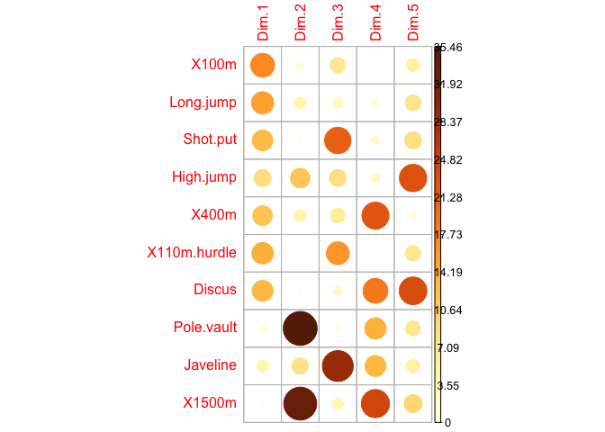<!-- -->

By particular PC

``` r
# Contributions of variables to PC1
fviz_contrib(res.pca, choice = "var", axes = 1, top = 10)
```

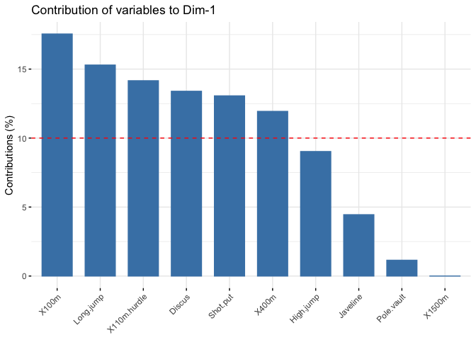<!-- -->

Coloring by contribution

``` r
fviz_pca_var(res.pca, col.var = "contrib",gradient.cols = c("#00AFBB", "#E7B800", "#FC4E07"))
```

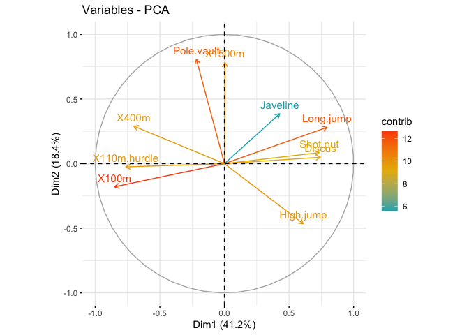<!-- -->

### Dimension description

``` r
res.desc <- dimdesc(res.pca, axes = c(1,2), proba = 0.05)
res.desc$Dim.1
```

    ## 
    ## Link between the variable and the continuous variables (R-square)
    ## =================================================================================
    ##              correlation      p.value
    ## Long.jump      0.7941806 6.059893e-06
    ## Discus         0.7432090 4.842563e-05
    ## Shot.put       0.7339127 6.723102e-05
    ## High.jump      0.6100840 1.993677e-03
    ## Javeline       0.4282266 4.149192e-02
    ## X400m         -0.7016034 1.910387e-04
    ## X110m.hurdle  -0.7641252 2.195812e-05
    ## X100m         -0.8506257 2.727129e-07

``` r
res.desc$Dim.2
```

    ## 
    ## Link between the variable and the continuous variables (R-square)
    ## =================================================================================
    ##            correlation      p.value
    ## Pole.vault   0.8074511 3.205016e-06
    ## X1500m       0.7844802 9.384747e-06
    ## High.jump   -0.4652142 2.529390e-02

### individuals

``` r
fviz_pca_ind(res.pca, col.ind = "cos2", gradient.cols = c("#00AFBB", "#E7B800", "#FC4E07"),repel = TRUE)
```

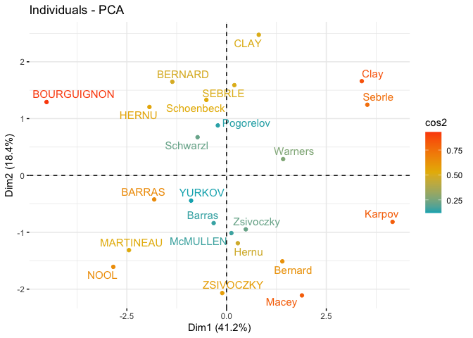<!-- -->

``` r
# Total contribution on PC1 and PC2
fviz_contrib(res.pca, choice = "ind", axes = 1:2)
```

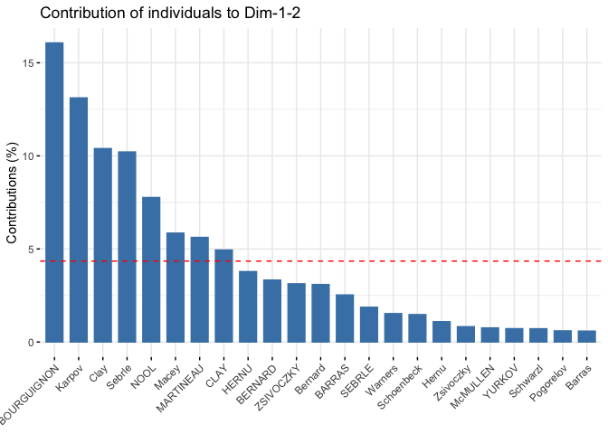<!-- -->

### biplot

``` r
fviz_pca_biplot(res.pca, repel = TRUE, col.var = "#2E9FDF", col.ind = "#696969")
```

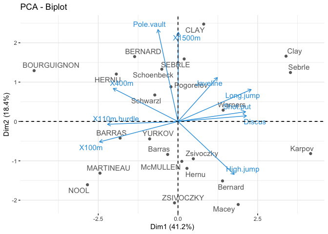<!-- -->

## clustering

``` r
library(FactoMineR)
# Compute PCA with ncp = 3
res2.pca <- PCA(USArrests, ncp = 3, graph = FALSE)
res.hcpc <- HCPC(res2.pca, graph = FALSE)

fviz_dend(res.hcpc,
cex = 0.7, 
palette = "jco", 
rect = TRUE, rect_fill = TRUE, 
rect_border = "jco", 
labels_track_height = 0.8 # Augment the room for labels
)
```

    ## Warning: The `<scale>` argument of `guides()` cannot be `FALSE`. Use "none" instead as
    ## of ggplot2 3.3.4.
    ## ℹ The deprecated feature was likely used in the factoextra package.
    ##   Please report the issue at <https://github.com/kassambara/factoextra/issues>.
    ## This warning is displayed once every 8 hours.
    ## Call `lifecycle::last_lifecycle_warnings()` to see where this warning was
    ## generated.

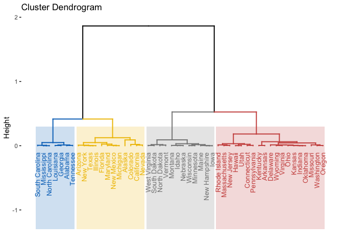<!-- -->

``` r
fviz_cluster(res.hcpc,
repel = TRUE, # Avoid label overlapping
show.clust.cent = TRUE, # Show cluster centers
palette = "jco", # Color palette see ?ggpubr::ggpar 
ggtheme = theme_minimal(),
main = "Factor map"
)
```

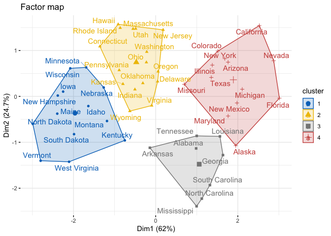<!-- -->

``` r
plot(res.hcpc, choice = "3D.map")
```

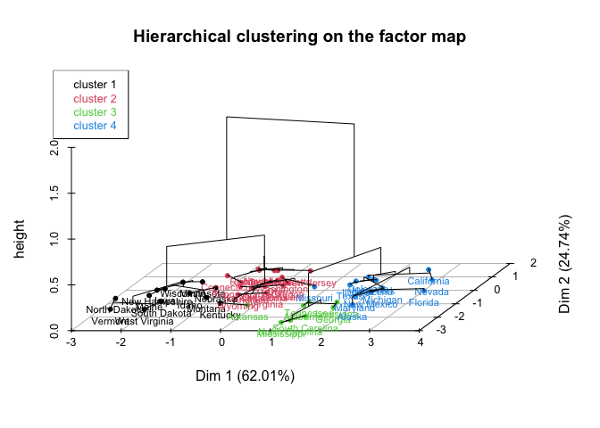<!-- -->
