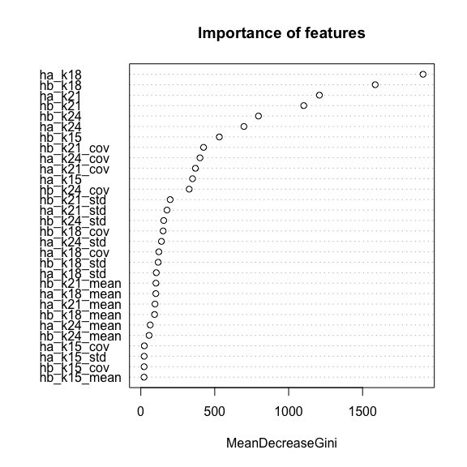
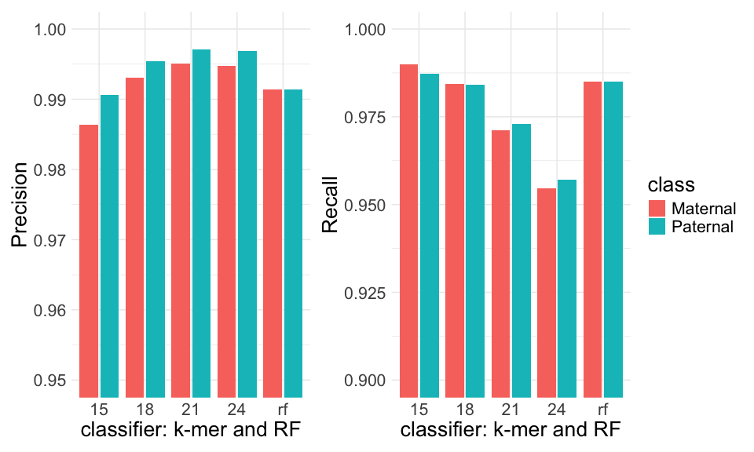

TrioRF
================
Alex Di Genova
2022-09-26

## Load data

we load the matrix generated with the python code

``` r
r=read.table("kidONT.R94.kmers.txt",h=T)
head(r)
```

    ##     id ha_k15 hb_k15 ha_k18 hb_k18 ha_k21 hb_k21 ha_k24 hb_k24 ha_k15_mean
    ## 1 K1_1     52    607     14    540     11    475     11    407        5667
    ## 2 K1_2     19    188      2    169      1    140      0    111        2204
    ## 3 K1_3     11     69      6     47      5     35      2     24        1266
    ## 4 K1_4     31    270      2    231      0    203      0    176        6096
    ## 5 K1_5     27    264      4    235      0    213      0    187        3687
    ## 6 K1_6     20    150      3    120      3    101      2     89        2365
    ##   ha_k15_std ha_k15_cov hb_k15_mean hb_k15_std hb_k15_cov ha_k18_mean
    ## 1       3091         98        4662       2895         98        7074
    ## 2       1048         79        2527        993         92        2568
    ## 3        758         78        1276        785         93         889
    ## 4       3167         94        6194       4051         98        1916
    ## 5       2163         92        4276       1741         96        5114
    ## 6       1165         86        1759       1334         98        1324
    ##   ha_k18_std ha_k18_cov hb_k18_mean hb_k18_std hb_k18_cov ha_k21_mean
    ## 1       2702         71        4621       2936         96        8305
    ## 2       1354         47        2668        906         77           0
    ## 3          1          0        1202        700         76         889
    ## 4          0          0        6169       4098         97           0
    ## 5       1147         37        4237       1725         95           0
    ## 6       1113         47        1868       1285         97        1321
    ##   ha_k21_std ha_k21_cov hb_k21_mean hb_k21_std hb_k21_cov ha_k24_mean
    ## 1        997         18        4661       2993         96        8304
    ## 2          0          0        2703        923         77           0
    ## 3          1          0        1320        699         70         887
    ## 4          0          0        6130       4157         96           0
    ## 5          0          0        4178       1777         95           0
    ## 6       1113         47        1909       1241         97        1961
    ##   ha_k24_std ha_k24_cov hb_k24_mean hb_k24_std hb_k24_cov
    ## 1        999         18        4685       3005         96
    ## 2          0          0        2789        901         77
    ## 3          0          0        1497        604         70
    ## 4          0          0        6172       4169         96
    ## 5          0          0        4151       1849         95
    ## 6          0          0        1976       1209         96

## Real clases

we do add the real class to the data

``` r
library(tidyverse)
```

    ## ── Attaching core tidyverse packages ──────────────────────── tidyverse 2.0.0 ──
    ## ✔ dplyr     1.1.4     ✔ readr     2.1.5
    ## ✔ forcats   1.0.0     ✔ stringr   1.5.1
    ## ✔ ggplot2   3.5.1     ✔ tibble    3.2.1
    ## ✔ lubridate 1.9.3     ✔ tidyr     1.3.1
    ## ✔ purrr     1.0.2     
    ## ── Conflicts ────────────────────────────────────────── tidyverse_conflicts() ──
    ## ✖ dplyr::filter() masks stats::filter()
    ## ✖ dplyr::lag()    masks stats::lag()
    ## ℹ Use the conflicted package (<http://conflicted.r-lib.org/>) to force all conflicts to become errors

``` r
r=r %>% mutate(class=if_else(startsWith(id,"K1"),"B","A")) 
```

## Baseline classification tool

This is how currently is performed the classification of
paternal/maternal haplotypes which is based on the hits for each mer.

``` doc
def compute_scaling_factors():
    num_kmers_a = kmers.get_number_kmers_in_set(haplotype_a_kmers)
    num_kmers_b = kmers.get_number_kmers_in_set(haplotype_b_kmers)
    max_num_kmers = max(num_kmers_a, num_kmers_b)
    scaling_factor_a = 1.0 * max_num_kmers / num_kmers_a
    scaling_factor_b = 1.0 * max_num_kmers / num_kmers_b
    return scaling_factor_a, scaling_factor_b
    
# determine the class
  hap_a_score = hap_a_count * scaling_factor_a
  hap_b_score = hap_b_count * scaling_factor_b

   if hap_a_score > hap_b_score:
     read_bin = "A"
  
  elif hap_b_score > hap_a_score:
        read_bin = "B"
   else:
    read_bin = "U"
   
```

we do implement the same strategy for R code

``` r
library(caret)
```

    ## Loading required package: lattice

    ## 
    ## Attaching package: 'caret'

    ## The following object is masked from 'package:purrr':
    ## 
    ##     lift

``` r
nk_hapa=c(1348958,1548667,1674112,1791266)
nk_hapb=c(963463,1138714,1262662,1376492)
sf_a=c(1,1,1,1)
sf_b=nk_hapa/nk_hapb
#k_15
r_k15=r %>% select(id,ha_k15,hb_k15,class) %>% 
  mutate(scoreA=ha_k15*sf_a[1],scoreB=hb_k15*sf_b[1], classp=if_else(scoreA > scoreB, "A",if_else(scoreA == scoreB, "U","B")))
r_k15[nrow(r_k15) + 1,] = c("dummy",0,0,"U",0,0,"U")
mk15=confusionMatrix(factor(r_k15$classp),factor(r_k15$class))
mk15
```

    ## Confusion Matrix and Statistics
    ## 
    ##           Reference
    ## Prediction     A     B     U
    ##          A 15798   150     0
    ##          B   205 14780     0
    ##          U     0     0     1
    ## 
    ## Overall Statistics
    ##                                           
    ##                Accuracy : 0.9885          
    ##                  95% CI : (0.9873, 0.9897)
    ##     No Information Rate : 0.5173          
    ##     P-Value [Acc > NIR] : < 2.2e-16       
    ##                                           
    ##                   Kappa : 0.977           
    ##                                           
    ##  Mcnemar's Test P-Value : NA              
    ## 
    ## Statistics by Class:
    ## 
    ##                      Class: A Class: B  Class: U
    ## Sensitivity            0.9872   0.9900 1.000e+00
    ## Specificity            0.9900   0.9872 1.000e+00
    ## Pos Pred Value         0.9906   0.9863 1.000e+00
    ## Neg Pred Value         0.9863   0.9906 1.000e+00
    ## Prevalence             0.5173   0.4826 3.233e-05
    ## Detection Rate         0.5107   0.4778 3.233e-05
    ## Detection Prevalence   0.5155   0.4844 3.233e-05
    ## Balanced Accuracy      0.9886   0.9886 1.000e+00

``` r
r_k18=r %>% select(id,ha_k18,hb_k18,class) %>% 
  mutate(scoreA=ha_k18*sf_a[2],scoreB=hb_k18*sf_b[2], classp=if_else(scoreA > scoreB, "A",if_else(scoreA == scoreB, "U","B")))
#we add a dummy class for classification purposes
r_k18[nrow(r_k18) + 1,] = c("dummy",0,0,"U",0,0,"U")
mk18=confusionMatrix(factor(r_k18$classp),factor(r_k18$class))
mk18
```

    ## Confusion Matrix and Statistics
    ## 
    ##           Reference
    ## Prediction     A     B     U
    ##          A 15750    73     0
    ##          B   103 14697     0
    ##          U   150   160     1
    ## 
    ## Overall Statistics
    ##                                           
    ##                Accuracy : 0.9843          
    ##                  95% CI : (0.9828, 0.9856)
    ##     No Information Rate : 0.5173          
    ##     P-Value [Acc > NIR] : < 2.2e-16       
    ##                                           
    ##                   Kappa : 0.9689          
    ##                                           
    ##  Mcnemar's Test P-Value : < 2.2e-16       
    ## 
    ## Statistics by Class:
    ## 
    ##                      Class: A Class: B  Class: U
    ## Sensitivity            0.9842   0.9844 1.000e+00
    ## Specificity            0.9951   0.9936 9.900e-01
    ## Pos Pred Value         0.9954   0.9930 3.215e-03
    ## Neg Pred Value         0.9833   0.9856 1.000e+00
    ## Prevalence             0.5173   0.4826 3.233e-05
    ## Detection Rate         0.5091   0.4751 3.233e-05
    ## Detection Prevalence   0.5115   0.4784 1.005e-02
    ## Balanced Accuracy      0.9897   0.9890 9.950e-01

``` r
#k21 is used in trio-binnig

r_k21=r %>% select(id,ha_k21,hb_k21,class) %>% 
  mutate(scoreA=ha_k21*sf_a[3],scoreB=hb_k21*sf_b[3], classp=if_else(scoreA > scoreB, "A",if_else(scoreA == scoreB, "U","B")))
#we add a dummy class for classification purposes
r_k21[nrow(r_k21) + 1,] = c("dummy",0,0,"U",0,0,"U")
mk21=confusionMatrix(factor(r_k21$classp),factor(r_k21$class))
mk21
```

    ## Confusion Matrix and Statistics
    ## 
    ##           Reference
    ## Prediction     A     B     U
    ##          A 15569    46     0
    ##          B    71 14498     0
    ##          U   363   386     1
    ## 
    ## Overall Statistics
    ##                                           
    ##                Accuracy : 0.972           
    ##                  95% CI : (0.9701, 0.9738)
    ##     No Information Rate : 0.5173          
    ##     P-Value [Acc > NIR] : < 2.2e-16       
    ##                                           
    ##                   Kappa : 0.9453          
    ##                                           
    ##  Mcnemar's Test P-Value : < 2.2e-16       
    ## 
    ## Statistics by Class:
    ## 
    ##                      Class: A Class: B  Class: U
    ## Sensitivity            0.9729   0.9711 1.000e+00
    ## Specificity            0.9969   0.9956 9.758e-01
    ## Pos Pred Value         0.9971   0.9951 1.333e-03
    ## Neg Pred Value         0.9717   0.9736 1.000e+00
    ## Prevalence             0.5173   0.4826 3.233e-05
    ## Detection Rate         0.5033   0.4687 3.233e-05
    ## Detection Prevalence   0.5048   0.4710 2.425e-02
    ## Balanced Accuracy      0.9849   0.9833 9.879e-01

``` r
r_k24=r %>% select(id,ha_k24,hb_k24,class) %>% 
  mutate(scoreA=ha_k24*sf_a[4],scoreB=hb_k24*sf_b[4], classp=if_else(scoreA > scoreB, "A",if_else(scoreA == scoreB, "U","B")))
#we add a dummy class for classification purposes
r_k24[nrow(r_k24) + 1,] = c("dummy",0,0,"U",0,0,"U")
mk24=confusionMatrix(factor(r_k24$classp),factor(r_k24$class))
mk24
```

    ## Confusion Matrix and Statistics
    ## 
    ##           Reference
    ## Prediction     A     B     U
    ##          A 15315    48     0
    ##          B    75 14253     0
    ##          U   613   629     1
    ## 
    ## Overall Statistics
    ##                                           
    ##                Accuracy : 0.9559          
    ##                  95% CI : (0.9535, 0.9581)
    ##     No Information Rate : 0.5173          
    ##     P-Value [Acc > NIR] : < 2.2e-16       
    ##                                           
    ##                   Kappa : 0.9151          
    ##                                           
    ##  Mcnemar's Test P-Value : < 2.2e-16       
    ## 
    ## Statistics by Class:
    ## 
    ##                      Class: A Class: B  Class: U
    ## Sensitivity            0.9570   0.9547 1.000e+00
    ## Specificity            0.9968   0.9953 9.598e-01
    ## Pos Pred Value         0.9969   0.9948 8.045e-04
    ## Neg Pred Value         0.9558   0.9592 1.000e+00
    ## Prevalence             0.5173   0.4826 3.233e-05
    ## Detection Rate         0.4951   0.4608 3.233e-05
    ## Detection Prevalence   0.4966   0.4632 4.018e-02
    ## Balanced Accuracy      0.9769   0.9750 9.799e-01

## Random forest classifier

### model build

``` r
library(randomForest)
```

    ## randomForest 4.7-1.1

    ## Type rfNews() to see new features/changes/bug fixes.

    ## 
    ## Attaching package: 'randomForest'

    ## The following object is masked from 'package:dplyr':
    ## 
    ##     combine

    ## The following object is masked from 'package:ggplot2':
    ## 
    ##     margin

``` r
library(caret)
library(e1071)
library(caTools)

feats=colnames(r)[2:length(r)]
rs=r[,feats]
ca=r[r$class=="A",]
cb=r[r$class=="B",]
ca=ca[sample(nrow(cb),nrow(cb)),]
rs=rbind(ca,cb)
rs=r[,feats]

rs$class=factor(rs$class)
sample = sample.split(rs$class, SplitRatio = 0.75)
train = subset(rs, sample == TRUE) # 75% training
test  = subset(rs, sample == FALSE) # 25% for evaluation
dim(train)
```

    ## [1] 23200    33

``` r
dim(test)
```

    ## [1] 7733   33

``` r
rf <- randomForest(
  class ~ .,
  #importance=T,
  data=train,
  keep.forest = TRUE
  )
```

### model evaluation

``` r
#we make the predictions
pred = predict(rf, newdata=test)
m=confusionMatrix(pred, test$class)

varImpPlot(rf,main="Importance of features")
```

<!-- -->

we build a consolidate plot by k-mer, random forest and class

``` r
library(knitr)
s=mk15$byClass[,5:7]
s=rbind(s,mk18$byClass[,5:7])
s=rbind(s,mk21$byClass[,5:7])
s=rbind(s,mk24$byClass[,5:7])
s=rbind(s,m$byClass[5:7])
s=rbind(s,m$byClass[5:7])
sd=as.data.frame(s)
sd$k=c(rep(15,3),rep(18,3),rep(21,3),rep(24,3),rep("rf",2))
sd$class=c(rep(c("Paternal","Maternal","U"),4),c("Paternal","Maternal"))
kable(sd,caption = "Precision, recall and F1 for haplotype classifiers")
```

|            | Precision |    Recall |        F1 | k   | class    |
|:-----------|----------:|----------:|----------:|:----|:---------|
| Class..A   | 0.9905944 | 0.9871899 | 0.9888892 | 15  | Paternal |
| Class..B   | 0.9863197 | 0.9899531 | 0.9881330 | 15  | Maternal |
| Class..U   | 1.0000000 | 1.0000000 | 1.0000000 | 15  | U        |
| Class..A.1 | 0.9953865 | 0.9841905 | 0.9897568 | 18  | Paternal |
| Class..B.1 | 0.9930405 | 0.9843938 | 0.9886983 | 18  | Maternal |
| Class..U.1 | 0.0032154 | 1.0000000 | 0.0064103 | 18  | U        |
| Class..A.2 | 0.9970541 | 0.9728801 | 0.9848188 | 21  | Paternal |
| Class..B.2 | 0.9951266 | 0.9710650 | 0.9829486 | 21  | Maternal |
| Class..U.2 | 0.0013333 | 1.0000000 | 0.0026631 | 21  | U        |
| Class..A.3 | 0.9968756 | 0.9570081 | 0.9765351 | 24  | Paternal |
| Class..B.3 | 0.9947655 | 0.9546551 | 0.9742976 | 24  | Maternal |
| Class..U.3 | 0.0008045 | 1.0000000 | 0.0016077 | 24  | U        |
| X          | 0.9914465 | 0.9850037 | 0.9882146 | rf  | Paternal |
| X.1        | 0.9914465 | 0.9850037 | 0.9882146 | rf  | Maternal |

Precision, recall and F1 for haplotype classifiers

we make the plots

``` r
library(patchwork)
p1=sd %>% filter(class != "U") %>% ggplot(aes(y=Precision, x=factor(k),fill=class)) + 
  geom_col(position="dodge2") +
  xlab("classifier: k-mer and RF")+
  theme_minimal() +
  coord_cartesian(ylim = c(0.95, 1))
p2=sd %>% filter(class != "U") %>% ggplot(aes(y=Recall, x=factor(k),fill=class)) +
  geom_col(position="dodge2")  +
  xlab("classifier: k-mer and RF")+
  theme_minimal()+ 
  coord_cartesian(ylim = c(0.9, 1))
# we merge plots
p1+p2+plot_layout(guides = 'collect') & theme(text = element_text(size = 20)) 
```

<!-- -->

# R info

``` r
devtools::session_info()
```

    ## ─ Session info ───────────────────────────────────────────────────────────────
    ##  setting  value
    ##  version  R version 4.3.2 (2023-10-31)
    ##  os       macOS Ventura 13.0.1
    ##  system   aarch64, darwin20
    ##  ui       X11
    ##  language (EN)
    ##  collate  en_US.UTF-8
    ##  ctype    en_US.UTF-8
    ##  tz       America/Santiago
    ##  date     2024-07-08
    ##  pandoc   3.1.1 @ /Applications/RStudio.app/Contents/Resources/app/quarto/bin/tools/ (via rmarkdown)
    ## 
    ## ─ Packages ───────────────────────────────────────────────────────────────────
    ##  package      * version    date (UTC) lib source
    ##  bitops         1.0-7      2021-04-24 [1] CRAN (R 4.3.0)
    ##  cachem         1.0.8      2023-05-01 [1] CRAN (R 4.3.0)
    ##  caret        * 6.0-94     2023-03-21 [1] CRAN (R 4.3.0)
    ##  caTools      * 1.18.2     2021-03-28 [1] CRAN (R 4.3.0)
    ##  class          7.3-22     2023-05-03 [1] CRAN (R 4.3.2)
    ##  cli            3.6.2      2023-12-11 [1] CRAN (R 4.3.1)
    ##  codetools      0.2-19     2023-02-01 [1] CRAN (R 4.3.2)
    ##  colorspace     2.1-0      2023-01-23 [1] CRAN (R 4.3.0)
    ##  data.table     1.15.0     2024-01-30 [1] CRAN (R 4.3.1)
    ##  devtools       2.4.5      2022-10-11 [1] CRAN (R 4.3.0)
    ##  digest         0.6.34     2024-01-11 [1] CRAN (R 4.3.1)
    ##  dplyr        * 1.1.4      2023-11-17 [1] CRAN (R 4.3.1)
    ##  e1071        * 1.7-14     2023-12-06 [1] CRAN (R 4.3.1)
    ##  ellipsis       0.3.2      2021-04-29 [1] CRAN (R 4.3.0)
    ##  evaluate       0.23       2023-11-01 [1] CRAN (R 4.3.1)
    ##  fansi          1.0.6      2023-12-08 [1] CRAN (R 4.3.1)
    ##  farver         2.1.1      2022-07-06 [1] CRAN (R 4.3.0)
    ##  fastmap        1.1.1      2023-02-24 [1] CRAN (R 4.3.0)
    ##  forcats      * 1.0.0      2023-01-29 [1] CRAN (R 4.3.0)
    ##  foreach        1.5.2      2022-02-02 [1] CRAN (R 4.3.0)
    ##  fs             1.6.3      2023-07-20 [1] CRAN (R 4.3.0)
    ##  future         1.33.2     2024-03-26 [1] CRAN (R 4.3.1)
    ##  future.apply   1.11.2     2024-03-28 [1] CRAN (R 4.3.1)
    ##  generics       0.1.3      2022-07-05 [1] CRAN (R 4.3.0)
    ##  ggplot2      * 3.5.1      2024-04-23 [1] CRAN (R 4.3.1)
    ##  globals        0.16.3     2024-03-08 [1] CRAN (R 4.3.1)
    ##  glue           1.7.0      2024-01-09 [1] CRAN (R 4.3.1)
    ##  gower          1.0.1      2022-12-22 [1] CRAN (R 4.3.0)
    ##  gtable         0.3.4      2023-08-21 [1] CRAN (R 4.3.0)
    ##  hardhat        1.3.1      2024-02-02 [1] CRAN (R 4.3.1)
    ##  highr          0.10       2022-12-22 [1] CRAN (R 4.3.0)
    ##  hms            1.1.3      2023-03-21 [1] CRAN (R 4.3.0)
    ##  htmltools      0.5.7      2023-11-03 [1] CRAN (R 4.3.1)
    ##  htmlwidgets    1.6.4      2023-12-06 [1] CRAN (R 4.3.1)
    ##  httpuv         1.6.14     2024-01-26 [1] CRAN (R 4.3.1)
    ##  ipred          0.9-14     2023-03-09 [1] CRAN (R 4.3.0)
    ##  iterators      1.0.14     2022-02-05 [1] CRAN (R 4.3.0)
    ##  knitr        * 1.45       2023-10-30 [1] CRAN (R 4.3.1)
    ##  labeling       0.4.3      2023-08-29 [1] CRAN (R 4.3.0)
    ##  later          1.3.2      2023-12-06 [1] CRAN (R 4.3.1)
    ##  lattice      * 0.22-5     2023-10-24 [1] CRAN (R 4.3.1)
    ##  lava           1.8.0      2024-03-05 [1] CRAN (R 4.3.1)
    ##  lifecycle      1.0.4      2023-11-07 [1] CRAN (R 4.3.1)
    ##  listenv        0.9.1      2024-01-29 [1] CRAN (R 4.3.1)
    ##  lubridate    * 1.9.3      2023-09-27 [1] CRAN (R 4.3.1)
    ##  magrittr       2.0.3      2022-03-30 [1] CRAN (R 4.3.0)
    ##  MASS           7.3-60.0.1 2024-01-13 [1] CRAN (R 4.3.1)
    ##  Matrix         1.6-5      2024-01-11 [1] CRAN (R 4.3.1)
    ##  memoise        2.0.1      2021-11-26 [1] CRAN (R 4.3.0)
    ##  mime           0.12       2021-09-28 [1] CRAN (R 4.3.0)
    ##  miniUI         0.1.1.1    2018-05-18 [1] CRAN (R 4.3.0)
    ##  ModelMetrics   1.2.2.2    2020-03-17 [1] CRAN (R 4.3.0)
    ##  munsell        0.5.0      2018-06-12 [1] CRAN (R 4.3.0)
    ##  nlme           3.1-164    2023-11-27 [1] CRAN (R 4.3.1)
    ##  nnet           7.3-19     2023-05-03 [1] CRAN (R 4.3.2)
    ##  parallelly     1.37.1     2024-02-29 [1] CRAN (R 4.3.1)
    ##  patchwork    * 1.2.0      2024-01-08 [1] CRAN (R 4.3.1)
    ##  pillar         1.9.0      2023-03-22 [1] CRAN (R 4.3.0)
    ##  pkgbuild       1.4.3      2023-12-10 [1] CRAN (R 4.3.1)
    ##  pkgconfig      2.0.3      2019-09-22 [1] CRAN (R 4.3.0)
    ##  pkgload        1.3.4      2024-01-16 [1] CRAN (R 4.3.1)
    ##  plyr           1.8.9      2023-10-02 [1] CRAN (R 4.3.1)
    ##  pROC           1.18.5     2023-11-01 [1] CRAN (R 4.3.1)
    ##  prodlim        2023.08.28 2023-08-28 [1] CRAN (R 4.3.0)
    ##  profvis        0.3.8      2023-05-02 [1] CRAN (R 4.3.0)
    ##  promises       1.2.1      2023-08-10 [1] CRAN (R 4.3.0)
    ##  proxy          0.4-27     2022-06-09 [1] CRAN (R 4.3.0)
    ##  purrr        * 1.0.2      2023-08-10 [1] CRAN (R 4.3.0)
    ##  R6             2.5.1      2021-08-19 [1] CRAN (R 4.3.0)
    ##  randomForest * 4.7-1.1    2022-05-23 [1] CRAN (R 4.3.0)
    ##  Rcpp           1.0.12     2024-01-09 [1] CRAN (R 4.3.1)
    ##  readr        * 2.1.5      2024-01-10 [1] CRAN (R 4.3.1)
    ##  recipes        1.0.10     2024-02-18 [1] CRAN (R 4.3.1)
    ##  remotes        2.4.2.1    2023-07-18 [1] CRAN (R 4.3.0)
    ##  reshape2       1.4.4      2020-04-09 [1] CRAN (R 4.3.0)
    ##  rlang          1.1.3      2024-01-10 [1] CRAN (R 4.3.1)
    ##  rmarkdown      2.25       2023-09-18 [1] CRAN (R 4.3.1)
    ##  rpart          4.1.23     2023-12-05 [1] CRAN (R 4.3.1)
    ##  rstudioapi     0.15.0     2023-07-07 [1] CRAN (R 4.3.0)
    ##  scales         1.3.0      2023-11-28 [1] CRAN (R 4.3.1)
    ##  sessioninfo    1.2.2      2021-12-06 [1] CRAN (R 4.3.0)
    ##  shiny          1.8.0      2023-11-17 [1] CRAN (R 4.3.1)
    ##  stringi        1.8.3      2023-12-11 [1] CRAN (R 4.3.1)
    ##  stringr      * 1.5.1      2023-11-14 [1] CRAN (R 4.3.1)
    ##  survival       3.5-7      2023-08-14 [1] CRAN (R 4.3.2)
    ##  tibble       * 3.2.1      2023-03-20 [1] CRAN (R 4.3.0)
    ##  tidyr        * 1.3.1      2024-01-24 [1] CRAN (R 4.3.1)
    ##  tidyselect     1.2.0      2022-10-10 [1] CRAN (R 4.3.0)
    ##  tidyverse    * 2.0.0      2023-02-22 [1] CRAN (R 4.3.0)
    ##  timechange     0.3.0      2024-01-18 [1] CRAN (R 4.3.1)
    ##  timeDate       4032.109   2023-12-14 [1] CRAN (R 4.3.1)
    ##  tzdb           0.4.0      2023-05-12 [1] CRAN (R 4.3.0)
    ##  urlchecker     1.0.1      2021-11-30 [1] CRAN (R 4.3.0)
    ##  usethis        2.2.3      2024-02-19 [1] CRAN (R 4.3.1)
    ##  utf8           1.2.4      2023-10-22 [1] CRAN (R 4.3.1)
    ##  vctrs          0.6.5      2023-12-01 [1] CRAN (R 4.3.1)
    ##  withr          3.0.0      2024-01-16 [1] CRAN (R 4.3.1)
    ##  xfun           0.41       2023-11-01 [1] CRAN (R 4.3.1)
    ##  xtable         1.8-4      2019-04-21 [1] CRAN (R 4.3.0)
    ##  yaml           2.3.8      2023-12-11 [1] CRAN (R 4.3.1)
    ## 
    ##  [1] /Library/Frameworks/R.framework/Versions/4.3-arm64/Resources/library
    ## 
    ## ──────────────────────────────────────────────────────────────────────────────
