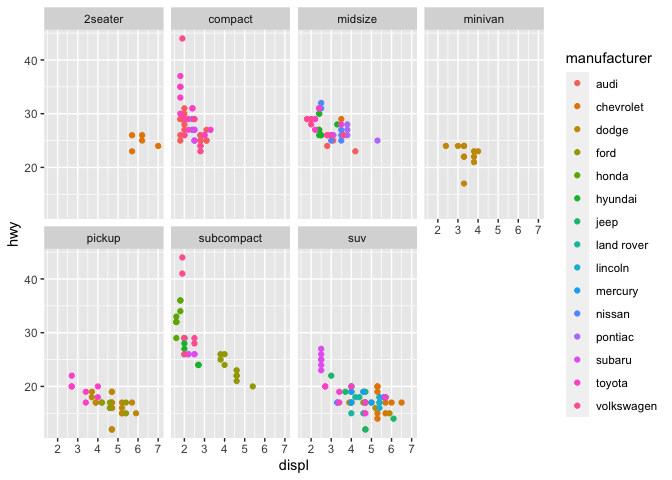

tidyverse
================
Alex Di Genova
2024-05-16

## tidyverse

``` r
library(tidyverse)
```

    ## ── Attaching core tidyverse packages ──────────────────────── tidyverse 2.0.0 ──
    ## ✔ dplyr     1.1.4     ✔ readr     2.1.5
    ## ✔ forcats   1.0.0     ✔ stringr   1.5.1
    ## ✔ ggplot2   3.4.4     ✔ tibble    3.2.1
    ## ✔ lubridate 1.9.3     ✔ tidyr     1.3.1
    ## ✔ purrr     1.0.2     
    ## ── Conflicts ────────────────────────────────────────── tidyverse_conflicts() ──
    ## ✖ dplyr::filter() masks stats::filter()
    ## ✖ dplyr::lag()    masks stats::lag()
    ## ℹ Use the conflicted package (<http://conflicted.r-lib.org/>) to force all conflicts to become errors

``` r
glimpse(mtcars)
```

    ## Rows: 32
    ## Columns: 11
    ## $ mpg  <dbl> 21.0, 21.0, 22.8, 21.4, 18.7, 18.1, 14.3, 24.4, 22.8, 19.2, 17.8,…
    ## $ cyl  <dbl> 6, 6, 4, 6, 8, 6, 8, 4, 4, 6, 6, 8, 8, 8, 8, 8, 8, 4, 4, 4, 4, 8,…
    ## $ disp <dbl> 160.0, 160.0, 108.0, 258.0, 360.0, 225.0, 360.0, 146.7, 140.8, 16…
    ## $ hp   <dbl> 110, 110, 93, 110, 175, 105, 245, 62, 95, 123, 123, 180, 180, 180…
    ## $ drat <dbl> 3.90, 3.90, 3.85, 3.08, 3.15, 2.76, 3.21, 3.69, 3.92, 3.92, 3.92,…
    ## $ wt   <dbl> 2.620, 2.875, 2.320, 3.215, 3.440, 3.460, 3.570, 3.190, 3.150, 3.…
    ## $ qsec <dbl> 16.46, 17.02, 18.61, 19.44, 17.02, 20.22, 15.84, 20.00, 22.90, 18…
    ## $ vs   <dbl> 0, 0, 1, 1, 0, 1, 0, 1, 1, 1, 1, 0, 0, 0, 0, 0, 0, 1, 1, 1, 1, 0,…
    ## $ am   <dbl> 1, 1, 1, 0, 0, 0, 0, 0, 0, 0, 0, 0, 0, 0, 0, 0, 0, 1, 1, 1, 0, 0,…
    ## $ gear <dbl> 4, 4, 4, 3, 3, 3, 3, 4, 4, 4, 4, 3, 3, 3, 3, 3, 3, 4, 4, 4, 3, 3,…
    ## $ carb <dbl> 4, 4, 1, 1, 2, 1, 4, 2, 2, 4, 4, 3, 3, 3, 4, 4, 4, 1, 2, 1, 1, 2,…

## tidyverse

operators and verbs

    ## # A tibble: 2 × 3
    ##   Species    AvgPetalLength AvgPetalWidth
    ##   <fct>               <dbl>         <dbl>
    ## 1 setosa               1.46         0.246
    ## 2 versicolor           4.26         1.33

## explore

``` r
glimpse(mpg)
```

    ## Rows: 234
    ## Columns: 11
    ## $ manufacturer <chr> "audi", "audi", "audi", "audi", "audi", "audi", "audi", "…
    ## $ model        <chr> "a4", "a4", "a4", "a4", "a4", "a4", "a4", "a4 quattro", "…
    ## $ displ        <dbl> 1.8, 1.8, 2.0, 2.0, 2.8, 2.8, 3.1, 1.8, 1.8, 2.0, 2.0, 2.…
    ## $ year         <int> 1999, 1999, 2008, 2008, 1999, 1999, 2008, 1999, 1999, 200…
    ## $ cyl          <int> 4, 4, 4, 4, 6, 6, 6, 4, 4, 4, 4, 6, 6, 6, 6, 6, 6, 8, 8, …
    ## $ trans        <chr> "auto(l5)", "manual(m5)", "manual(m6)", "auto(av)", "auto…
    ## $ drv          <chr> "f", "f", "f", "f", "f", "f", "f", "4", "4", "4", "4", "4…
    ## $ cty          <int> 18, 21, 20, 21, 16, 18, 18, 18, 16, 20, 19, 15, 17, 17, 1…
    ## $ hwy          <int> 29, 29, 31, 30, 26, 26, 27, 26, 25, 28, 27, 25, 25, 25, 2…
    ## $ fl           <chr> "p", "p", "p", "p", "p", "p", "p", "p", "p", "p", "p", "p…
    ## $ class        <chr> "compact", "compact", "compact", "compact", "compact", "c…

``` r
ggplot(mpg) + geom_point(mapping = aes(x = displ, y = hwy))
```

<!-- -->

### Facets

``` r
ggplot(data = mpg) +
  geom_point(mapping = aes(x = displ, y = hwy, color=manufacturer)) +
  facet_wrap(~ class, nrow = 2)
```

<!-- -->

## Dplyr

### Filter

``` r
mpg %>% filter(manufacturer == "audi") %>% head()
```

    ## # A tibble: 6 × 11
    ##   manufacturer model displ  year   cyl trans      drv     cty   hwy fl    class 
    ##   <chr>        <chr> <dbl> <int> <int> <chr>      <chr> <int> <int> <chr> <chr> 
    ## 1 audi         a4      1.8  1999     4 auto(l5)   f        18    29 p     compa…
    ## 2 audi         a4      1.8  1999     4 manual(m5) f        21    29 p     compa…
    ## 3 audi         a4      2    2008     4 manual(m6) f        20    31 p     compa…
    ## 4 audi         a4      2    2008     4 auto(av)   f        21    30 p     compa…
    ## 5 audi         a4      2.8  1999     6 auto(l5)   f        16    26 p     compa…
    ## 6 audi         a4      2.8  1999     6 manual(m5) f        18    26 p     compa…

``` r
mpg %>% filter(manufacturer %in% c("audi","chevrolet")) %>% arrange(desc(year),manufacturer)
```

    ## # A tibble: 37 × 11
    ##    manufacturer model      displ  year   cyl trans drv     cty   hwy fl    class
    ##    <chr>        <chr>      <dbl> <int> <int> <chr> <chr> <int> <int> <chr> <chr>
    ##  1 audi         a4           2    2008     4 manu… f        20    31 p     comp…
    ##  2 audi         a4           2    2008     4 auto… f        21    30 p     comp…
    ##  3 audi         a4           3.1  2008     6 auto… f        18    27 p     comp…
    ##  4 audi         a4 quattro   2    2008     4 manu… 4        20    28 p     comp…
    ##  5 audi         a4 quattro   2    2008     4 auto… 4        19    27 p     comp…
    ##  6 audi         a4 quattro   3.1  2008     6 auto… 4        17    25 p     comp…
    ##  7 audi         a4 quattro   3.1  2008     6 manu… 4        15    25 p     comp…
    ##  8 audi         a6 quattro   3.1  2008     6 auto… 4        17    25 p     mids…
    ##  9 audi         a6 quattro   4.2  2008     8 auto… 4        16    23 p     mids…
    ## 10 chevrolet    c1500 sub…   5.3  2008     8 auto… r        14    20 r     suv  
    ## # ℹ 27 more rows

### select

select columns by name

``` r
mpg %>% select(model,manufacturer,cyl)
```

    ## # A tibble: 234 × 3
    ##    model      manufacturer   cyl
    ##    <chr>      <chr>        <int>
    ##  1 a4         audi             4
    ##  2 a4         audi             4
    ##  3 a4         audi             4
    ##  4 a4         audi             4
    ##  5 a4         audi             6
    ##  6 a4         audi             6
    ##  7 a4         audi             6
    ##  8 a4 quattro audi             4
    ##  9 a4 quattro audi             4
    ## 10 a4 quattro audi             4
    ## # ℹ 224 more rows

``` r
# Select all columns between model and year (inclusive)
mpg %>% select(model:year)
```

    ## # A tibble: 234 × 3
    ##    model      displ  year
    ##    <chr>      <dbl> <int>
    ##  1 a4           1.8  1999
    ##  2 a4           1.8  1999
    ##  3 a4           2    2008
    ##  4 a4           2    2008
    ##  5 a4           2.8  1999
    ##  6 a4           2.8  1999
    ##  7 a4           3.1  2008
    ##  8 a4 quattro   1.8  1999
    ##  9 a4 quattro   1.8  1999
    ## 10 a4 quattro   2    2008
    ## # ℹ 224 more rows

``` r
# Select all columns except those between model and year (inclusive)
mpg %>% select(-(model:year))
```

    ## # A tibble: 234 × 8
    ##    manufacturer   cyl trans      drv     cty   hwy fl    class  
    ##    <chr>        <int> <chr>      <chr> <int> <int> <chr> <chr>  
    ##  1 audi             4 auto(l5)   f        18    29 p     compact
    ##  2 audi             4 manual(m5) f        21    29 p     compact
    ##  3 audi             4 manual(m6) f        20    31 p     compact
    ##  4 audi             4 auto(av)   f        21    30 p     compact
    ##  5 audi             6 auto(l5)   f        16    26 p     compact
    ##  6 audi             6 manual(m5) f        18    26 p     compact
    ##  7 audi             6 auto(av)   f        18    27 p     compact
    ##  8 audi             4 manual(m5) 4        18    26 p     compact
    ##  9 audi             4 auto(l5)   4        16    25 p     compact
    ## 10 audi             4 manual(m6) 4        20    28 p     compact
    ## # ℹ 224 more rows

``` r
mpg %>% select(trans, drv, everything())
```

    ## # A tibble: 234 × 11
    ##    trans      drv   manufacturer model displ  year   cyl   cty   hwy fl    class
    ##    <chr>      <chr> <chr>        <chr> <dbl> <int> <int> <int> <int> <chr> <chr>
    ##  1 auto(l5)   f     audi         a4      1.8  1999     4    18    29 p     comp…
    ##  2 manual(m5) f     audi         a4      1.8  1999     4    21    29 p     comp…
    ##  3 manual(m6) f     audi         a4      2    2008     4    20    31 p     comp…
    ##  4 auto(av)   f     audi         a4      2    2008     4    21    30 p     comp…
    ##  5 auto(l5)   f     audi         a4      2.8  1999     6    16    26 p     comp…
    ##  6 manual(m5) f     audi         a4      2.8  1999     6    18    26 p     comp…
    ##  7 auto(av)   f     audi         a4      3.1  2008     6    18    27 p     comp…
    ##  8 manual(m5) 4     audi         a4 q…   1.8  1999     4    18    26 p     comp…
    ##  9 auto(l5)   4     audi         a4 q…   1.8  1999     4    16    25 p     comp…
    ## 10 manual(m6) 4     audi         a4 q…   2    2008     4    20    28 p     comp…
    ## # ℹ 224 more rows

### mutate

``` r
mpg %>% mutate(delta=hwy-cty) 
```

    ## # A tibble: 234 × 12
    ##    manufacturer model      displ  year   cyl trans drv     cty   hwy fl    class
    ##    <chr>        <chr>      <dbl> <int> <int> <chr> <chr> <int> <int> <chr> <chr>
    ##  1 audi         a4           1.8  1999     4 auto… f        18    29 p     comp…
    ##  2 audi         a4           1.8  1999     4 manu… f        21    29 p     comp…
    ##  3 audi         a4           2    2008     4 manu… f        20    31 p     comp…
    ##  4 audi         a4           2    2008     4 auto… f        21    30 p     comp…
    ##  5 audi         a4           2.8  1999     6 auto… f        16    26 p     comp…
    ##  6 audi         a4           2.8  1999     6 manu… f        18    26 p     comp…
    ##  7 audi         a4           3.1  2008     6 auto… f        18    27 p     comp…
    ##  8 audi         a4 quattro   1.8  1999     4 manu… 4        18    26 p     comp…
    ##  9 audi         a4 quattro   1.8  1999     4 auto… 4        16    25 p     comp…
    ## 10 audi         a4 quattro   2    2008     4 manu… 4        20    28 p     comp…
    ## # ℹ 224 more rows
    ## # ℹ 1 more variable: delta <int>

``` r
mpg %>% summarise(mean(hwy))
```

    ## # A tibble: 1 × 1
    ##   `mean(hwy)`
    ##         <dbl>
    ## 1        23.4

``` r
mpg %>% group_by(manufacturer) %>% summarize(m=mean(hwy)) %>% arrange(desc(m))
```

    ## # A tibble: 15 × 2
    ##    manufacturer     m
    ##    <chr>        <dbl>
    ##  1 honda         32.6
    ##  2 volkswagen    29.2
    ##  3 hyundai       26.9
    ##  4 audi          26.4
    ##  5 pontiac       26.4
    ##  6 subaru        25.6
    ##  7 toyota        24.9
    ##  8 nissan        24.6
    ##  9 chevrolet     21.9
    ## 10 ford          19.4
    ## 11 mercury       18  
    ## 12 dodge         17.9
    ## 13 jeep          17.6
    ## 14 lincoln       17  
    ## 15 land rover    16.5

## Import Data

### readr

``` r
a=read_csv("../data/worldcitiespop.csv.gz")
```

    ## Rows: 3173958 Columns: 7
    ## ── Column specification ────────────────────────────────────────────────────────
    ## Delimiter: ","
    ## chr (4): Country, City, AccentCity, Region
    ## dbl (3): Population, Latitude, Longitude
    ## 
    ## ℹ Use `spec()` to retrieve the full column specification for this data.
    ## ℹ Specify the column types or set `show_col_types = FALSE` to quiet this message.

``` r
glimpse(a)
```

    ## Rows: 3,173,958
    ## Columns: 7
    ## $ Country    <chr> "ad", "ad", "ad", "ad", "ad", "ad", "ad", "ad", "ad", "ad",…
    ## $ City       <chr> "aixas", "aixirivali", "aixirivall", "aixirvall", "aixovall…
    ## $ AccentCity <chr> "Aixàs", "Aixirivali", "Aixirivall", "Aixirvall", "Aixovall…
    ## $ Region     <chr> "06", "06", "06", "06", "06", "07", "07", "07", "07", "07",…
    ## $ Population <dbl> NA, NA, NA, NA, NA, NA, 20430, NA, NA, NA, NA, NA, NA, NA, …
    ## $ Latitude   <dbl> 42.48333, 42.46667, 42.46667, 42.46667, 42.46667, 42.50000,…
    ## $ Longitude  <dbl> 1.466667, 1.500000, 1.500000, 1.500000, 1.483333, 1.516667,…

other examples

``` r
read_csv("The first line of metadata
  The second line of metadata
  x,y,z
  1,2,3", skip = 2)
```

    ## Rows: 1 Columns: 3
    ## ── Column specification ────────────────────────────────────────────────────────
    ## Delimiter: ","
    ## dbl (3): x, y, z
    ## 
    ## ℹ Use `spec()` to retrieve the full column specification for this data.
    ## ℹ Specify the column types or set `show_col_types = FALSE` to quiet this message.

    ## # A tibble: 1 × 3
    ##       x     y     z
    ##   <dbl> <dbl> <dbl>
    ## 1     1     2     3

``` r
read_csv("# A comment I want to skip
  x,y,z
  1,2,3", comment = "#")
```

    ## Rows: 1 Columns: 3
    ## ── Column specification ────────────────────────────────────────────────────────
    ## Delimiter: ","
    ## dbl (3): x, y, z
    ## 
    ## ℹ Use `spec()` to retrieve the full column specification for this data.
    ## ℹ Specify the column types or set `show_col_types = FALSE` to quiet this message.

    ## # A tibble: 1 × 3
    ##       x     y     z
    ##   <dbl> <dbl> <dbl>
    ## 1     1     2     3

``` r
read_csv("1,2,3\n4,5,6", col_names = c("x", "y", "z"))
```

    ## Rows: 2 Columns: 3
    ## ── Column specification ────────────────────────────────────────────────────────
    ## Delimiter: ","
    ## dbl (3): x, y, z
    ## 
    ## ℹ Use `spec()` to retrieve the full column specification for this data.
    ## ℹ Specify the column types or set `show_col_types = FALSE` to quiet this message.

    ## # A tibble: 2 × 3
    ##       x     y     z
    ##   <dbl> <dbl> <dbl>
    ## 1     1     2     3
    ## 2     4     5     6

parsing numbers

``` r
parse_number("$100")
```

    ## [1] 100

``` r
parse_number("20%")
```

    ## [1] 20

``` r
parse_number("It cost $123.45")
```

    ## [1] 123.45

parsing dates

``` r
parse_date("01/02/15", "%m/%d/%y")
```

    ## [1] "2015-01-02"

``` r
parse_date("01/02/15", "%d/%m/%y")
```

    ## [1] "2015-02-01"

``` r
parse_date("01/02/15", "%y/%m/%d")
```

    ## [1] "2001-02-15"

``` r
parse_date("12 Enero 2015", "%d %B %Y", locale = locale("es"))
```

    ## [1] "2015-01-12"

guest type

``` r
guess_parser("2010-10-01")
```

    ## [1] "date"

``` r
guess_parser("15:01")
```

    ## [1] "time"

``` r
guess_parser(c("TRUE", "FALSE"))
```

    ## [1] "logical"

``` r
guess_parser(c("1", "5", "9"))
```

    ## [1] "double"

``` r
guess_parser(c("12,352,561"))
```

    ## [1] "number"

## Tidy data

gathering

``` r
table4a  %>% gather(`1999`,`2000`, key="year",value="population")
```

    ## # A tibble: 6 × 3
    ##   country     year  population
    ##   <chr>       <chr>      <dbl>
    ## 1 Afghanistan 1999         745
    ## 2 Brazil      1999       37737
    ## 3 China       1999      212258
    ## 4 Afghanistan 2000        2666
    ## 5 Brazil      2000       80488
    ## 6 China       2000      213766

spreading

``` r
table2 %>%spread(key=type, value=count)
```

    ## # A tibble: 6 × 4
    ##   country      year  cases population
    ##   <chr>       <dbl>  <dbl>      <dbl>
    ## 1 Afghanistan  1999    745   19987071
    ## 2 Afghanistan  2000   2666   20595360
    ## 3 Brazil       1999  37737  172006362
    ## 4 Brazil       2000  80488  174504898
    ## 5 China        1999 212258 1272915272
    ## 6 China        2000 213766 1280428583
